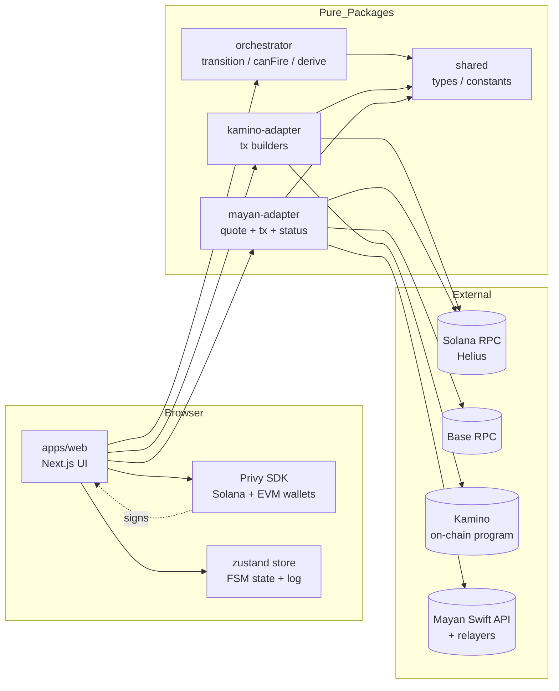
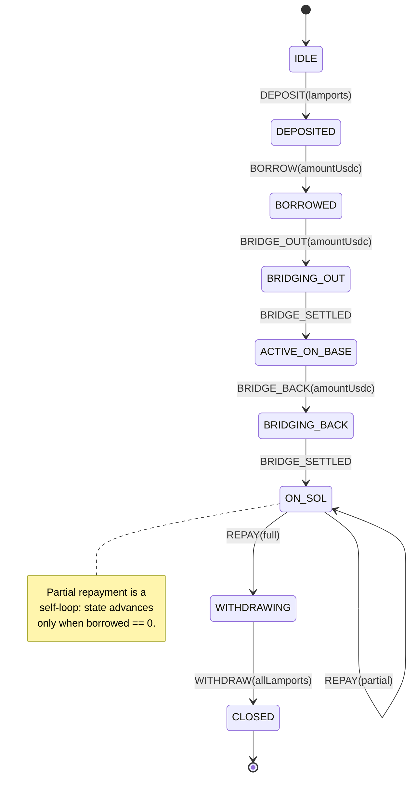
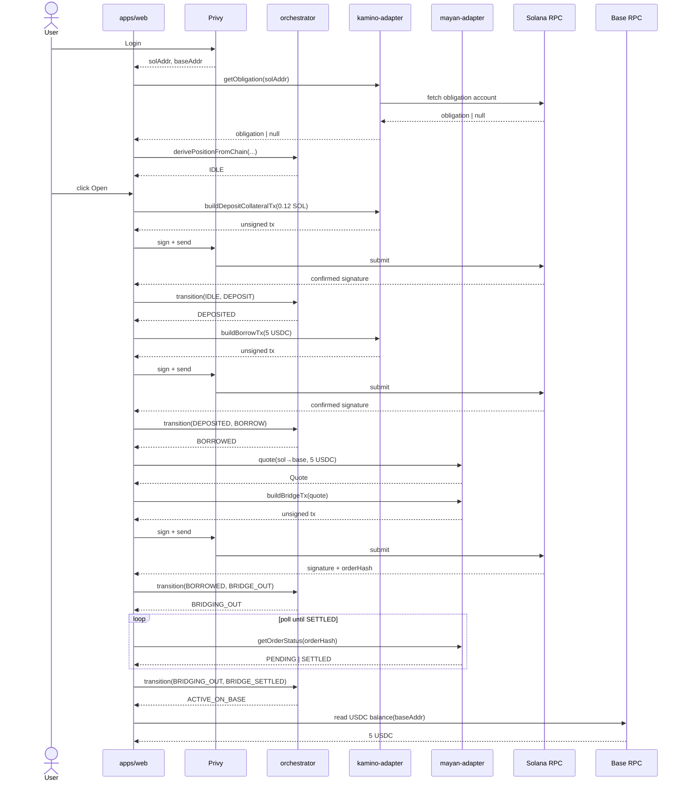
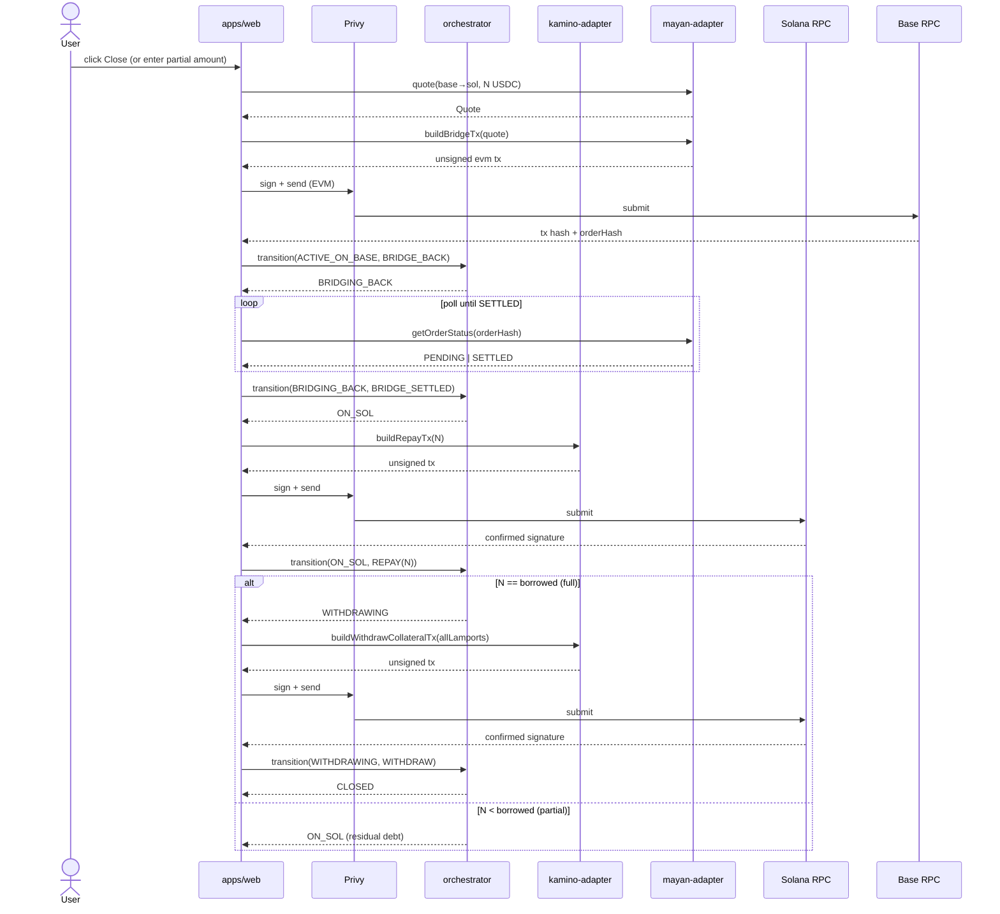
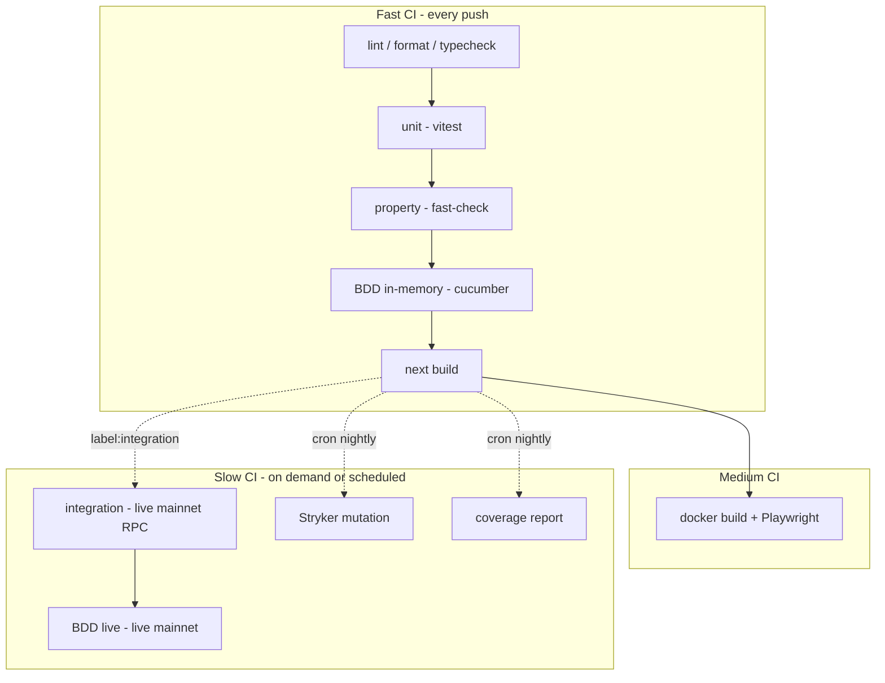
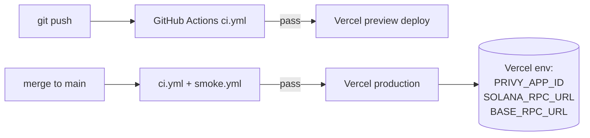

# Architecture

Visual reference for the KAST DeFi project. Design decisions live in the RFC at `docs/superpowers/specs/2026-04-20-kast-defi-design.md`; this document focuses on **what things are**, **how they connect**, and **how data flows**.

---

## 1. Repository Layout

```mermaid
graph TD
    root[kast-project/]
    root --> apps[apps/]
    root --> packages[packages/]
    root --> scenario[scenario-tests/]
    root --> integ[integration-tests/]
    root --> docker[docker/]
    root --> workflows[.github/workflows/]
    root --> docs[docs/]

    apps --> web[web/ — Next.js 15 App Router]

    packages --> kamino[kamino-adapter/]
    packages --> mayan[mayan-adapter/]
    packages --> orch[orchestrator/ — pure FSM]
    packages --> verify[verify/ — fast-check]
    packages --> shared[shared/ — types, errors]

    scenario --> features[features/*.feature]
    scenario --> orchBdd[orchestrator/ — in-memory runner]
    scenario --> liveBdd[live/ — mainnet runner]

    workflows --> ci[ci.yml]
    workflows --> integYml[integration.yml]
    workflows --> smoke[smoke.yml]
    workflows --> nightly[nightly.yml]

    docs --> arch[ARCHITECTURE.md]
    docs --> aiOrch[AI_ORCHESTRATION.md]
    docs --> tlog[TIME_LOG.md]
    docs --> prog[PROGRESS.md]
    docs --> rfc[superpowers/specs/2026-04-20-kast-defi-design.md]
```

---

## 2. Component Map

Adapters are pure Node packages — no React, no browser APIs. The UI is the only layer that touches Privy and the zustand store.

---

## 3. Position State Machine

**Invariants verified by property tests** (`packages/verify/`):

- No path reaches `CLOSED` with `obligation.borrowed > 0`.
- No path reaches `CLOSED` with `obligation.collateral > 0`.
- `transition(s, e)` is deterministic and total for all legal `(s, e)` pairs.
- `canFire(s, e)` is true iff `transition(s, e)` would not throw.
- Amount round-trips: `lamportsToSol(solToLamports(x)) == x` for valid `x`.
- Repay is monotonic: `borrowed_after_repay ≤ borrowed_before_repay`.

---

## 4. Happy-Path Data Flow

---

## 5. Close-Path Data Flow

---

## 6. Test Topology

---

## 7. Deployment

---

## 8. What Lives Where (quick reference)

| Concern | Location |
|---|---|
| UI components | `apps/web/src/components/` |
| UI pages | `apps/web/src/app/` |
| Client state store | `apps/web/src/lib/store.ts` |
| Privy providers | `apps/web/src/lib/privy.tsx` |
| Kamino SDK calls | `packages/kamino-adapter/src/` |
| Mayan SDK calls | `packages/mayan-adapter/src/` |
| State machine | `packages/orchestrator/src/fsm.ts` |
| State derivation from chain | `packages/orchestrator/src/derive.ts` |
| Property tests | `packages/verify/src/` |
| Gherkin features | `scenario-tests/features/*.feature` |
| Cucumber step defs | `scenario-tests/orchestrator/steps.ts`, `scenario-tests/live/steps.ts` |
| Live integration tests | `integration-tests/src/` |
| Dockerfile | `docker/Dockerfile` |
| Playwright smoke | `docker/smoke.spec.ts` |
| CI workflows | `.github/workflows/` |
| RFC / spec | `docs/superpowers/specs/2026-04-20-kast-defi-design.md` |
| Future work | `docs/PROGRESS.md` |
| AI workflow writeup | `docs/AI_ORCHESTRATION.md` |
| Time log | `docs/TIME_LOG.md` |
